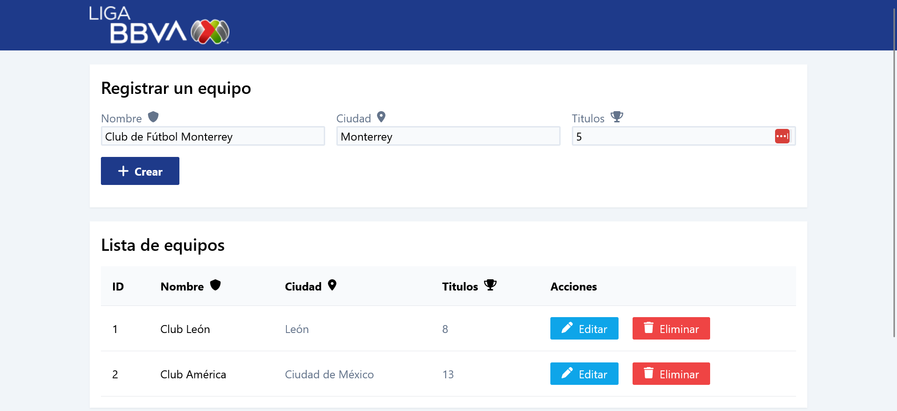

# CRUD Liga MX

## Descripción 🏝️

Sistema web para crear, leer, actualizar y eliminar equipos de la Liga BBVA MX ⚽, mediante el uso de una API REST local falsa proporcionada por json-server.
También hace uso de componentes reactivos hechos con JS puro para el manejo del estado y componentes UI.


## Autor ✒️

**JSamuel**

- [LinkeIn](https://www.linkedin.com/in/jsamuelap/)
- [Twitter](https://twitter.com/JSamuelAP)
- [GitHub](https://github.com/JSamuelAP)
- [Portafolio 💼](https://jsamuelap.github.io/)
- [Email 📧](mailto:sp4619168@gmail.com)

## Ver ejemplo en vivo 👀

Este proyecto no cuenta con una demostración pública en internet. Si se desea probar se tiene que descargar el proyecto y seguir los pasos de la instalación.

## Instalación 💻

Es necesario tener instalado Node para ejecutar los siguientes comandos en una terminal:

```bash
npm install
npm run server
npm run dev
```

Los datos de los equipos los puedes ver en el [home de JSON-Server](localhost:3000)

El sistema se encuentra en [localhost:5173](localhost:5173)

## Licencia ⚖️

MIT License
